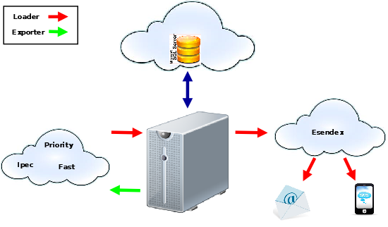

.. Toll Parcel Portal B2C Middleware documentation master file

Toll Parcel Portal B2C Middleware
=================================

Overview
--------

The Toll Parcel Portal B2C middleware package presents an interface to the
various Toll divisions to upload missed parcel collection information into
the Toll `Parcel Portal <https://nparcel.tollgroup.com>`

The following diagram describes various interfaces at a high-level:

*The Toll Parcel Portal B2C Middleware workflow*

Contents
--------
.. toctree::
    :maxdepth: 2

    init.rst
    interfaces/index.rst
    source_code.rst
    modules/index.rst

Indices and tables
==================

* :ref:`genindex`
* :ref:`modindex`
* :ref:`search`
