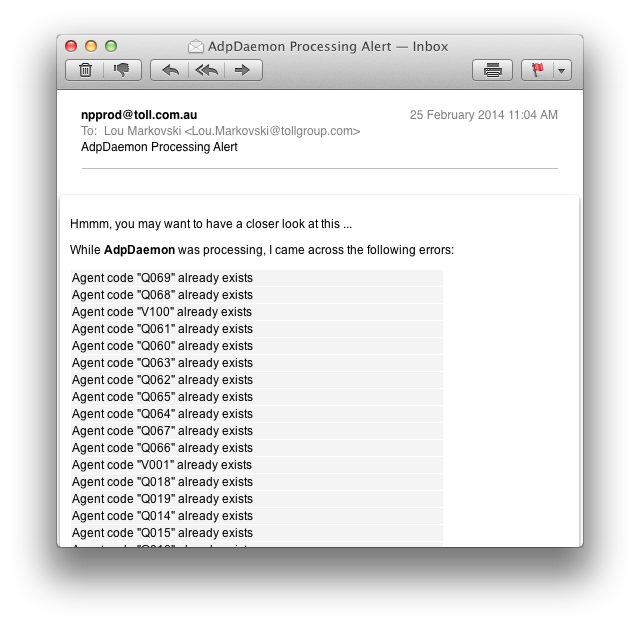

.. Toll Outlet Portal Middleware Alternate Delivery Point Bulk Load

.. toctree::
    :maxdepth: 2

.. _adp:

Alternate Delivery Point (ADP) Bulk Load
========================================

*New in version 0.30*

The ``topadpd`` daemon manages the bulk load of new ADP resources into the
Toll Outlet Portal ``agent`` table.

.. note::

    As of *version 0.38*, ``topadpd`` supports updates

Supported file types include:

    * Excel ``*.xlsx``
    * CSV

.. note::

    During the ADP file load process, if an ``*.xlsx`` is encountered the
    ``topadpd`` daemon will attempt to translate the file into ``*.csv``.
    
    Both ``*.xlsx`` and ``*.csv`` variant will be archived

``topadpd`` Interfaces
----------------------

``topadpd`` can be configured to poll a directory resource for new ADP
bulk load files.  As such, it is possible to FTP the ADP bulk load
files to where the ``adpd`` daemon is running to have them be
automatically loaded into the ``agent`` table.

.. note::

    Refer to :ref:`ftp_drop_box` for how to set up the FTP drop box

Alternatively, an ADP bulk insert file can be provide on the command line
using the ``-f`` switch:: 

    $ topadpd -f /var/tmp/ADP-Bulk-Load.xlsx

With the ``-f`` switch, the daemon will run in batch mode (perform a single
iteration)

The ADP bulk Load File Format
-----------------------------

The ADP bulk load file format should contain a series of column names
that map to a Toll Outlet Portal table column.

.. note::

    Refer to the :ref:`adp_headers <adp_headers>` config setting on how to
    define the mappings

At this time, the structure of the ADP bulk load file format is managed
by the Toll Outlet Portal support team.  Should new headers be added
to the ADP bulk insert file then the configuration must be updated to
reflect the change.  Otherwise, the new column will be ignored.

ADP Updates
-----------

*New in version 0.38*

If run in update mode, ``topadpd`` will parse the source files and attempt
to update the ``agent`` table columns.

.. note::

    only the ``agent`` table value updates are supported at this time

To invoke ``topadpd`` in update mode you must provide the ``-u`` switch
on the command line::

    $ topadpd -u start

The ``topadpd`` updater has been design so that the same ADP bulk load
Excel spreadsheet can be used.  With this in mind, there are a few
conditions that need to be met:

* The column associated with the ``agent.code`` table column is mandatory
* Only fields with data will be updated (empty cells will be skipped)

``topadpd`` Logging
-------------------

As with all middleware components, logging is captured in a separate file.
Typically, the log file can be found at ``<HOME>/.top/logs/topadpd.log``

``topadpd`` Usage
-----------------

``topondeliveryd`` is a CLI-based daemoniser that controls the
On Delivery comms trigger process::

    $ topadpd -h
    usage: topadpd [options] start|stop|status
    
    options:
      -h, --help            show this help message and exit
      -v, --verbose         raise logging verbosity
      -d, --dry             dry run - report only, do not execute
      -b, --batch           single pass batch mode
      -c CONFIG, --config=CONFIG
                            override default config
                            "/home/npprod/.top/top.conf"
      -f FILE, --file=FILE  file to process inline (start only)
      -u, --update          update the ADP details

ADP Insert
----------

In addition to the insertion into the ``agent`` table, the ``topadpd``
daemon will also create a corresponding record in the ``login_access``
and ``login_account`` table to support the ADP login function into the
Toll Outlet Portal website.

ADP Insert Exceptions
---------------------

``topadpd`` will abort an ADP insert under the following conditions:

.. note::

    the following bolded names relate to the columns of the ADP
    bulk insert file

* **TP Code** (or ``agent.code`` column, for example ``V001``) already
  exists in the database

* **Username** is not provided

* **State/postcode** combination validation has failed

* **Username** must be able to source the default password

* **DP Id** (delivery partner ID) is a valid integer value

Exceptions to these validation rules will cause the ADP file line
item to be rejected.  In the case of a batch run, the failures
will be emailed to the Toll Outlet Support email address.  A
typical mail message is shown below:

``topadpd`` Configuration Items
-------------------------------

The ``topondeliveryd`` utility uses the default ``top.conf`` file to
control processing workflows.

.. note::
    all configuration settings are found under the ``[adp]``
    section unless otherwise specified

* ``support`` (under the ``[email]`` section)

    list of email addresses that will received support notifications

* ``adp_in`` (under the ``[dirs]`` section)

    list of directories to search for ADP bulk insert files

* ``archive`` (under the ``[dirs]`` section)

    where to archive ADP file after processing.  The token ``adp`` is
    appended to the archive directory root to separate it from other
    archive directories

* ``code_header``

    special ADP bulk insert header name override that relates to
    the ``agent.code`` column (default is ``TP Code``)

* ``file_formats``

    list of python-based regular expressions that represent
    the type of files that are accepted by the ADP loader.

    .. note::

        Leave this blank to attempt to process all files

* ``adp_loop`` (under the ``[timeout]`` section)

    time (seconds) between ``topondeliveryd`` processing iterations

* ``db`` (the actual ``[db]`` section)

    Toll Outlet Portal database connectivity information.  A typical
    example is::

        [db]
        driver = FreeTDS
        host = SQVDBAUT07
        database = Nparcel
        user = npscript
        password = <passwd>

.. _adp_headers:

* ``adp_headers`` (under the ``[adp_headers]`` section)

    dictionary of Toll Outlet Portal database table columns to column
    headers in the ADP bulk insert file.  The database and table is
    delimited as ``table_name.column_name`` in an attempt to distinguish
    between common column names across tables.  For example::

        [adp_headers]
        agent.code = TP Code
        agent.dp_code = DP Code
        agent.name = ADP Name
        agent.address = Address
        agent.suburb = Suburb
        agent.state = State
        agent.postcode = Postcode
        agent.opening_hours = Opening Hours
        agent.notes = Notes
        agent.parcel_size_code = ADP Accepts Parcel Size
        agent.phone_nbr = Phone
        agent.contact_name = Contact
        agent.email = Email
        agent.fax_nbr = Fax
        agent.status = Active
        delivery_partner.id = DP Id
        login_account.username = Username

.. _delivery_partners:

* ``delivery_partners``

    list of ``delivery_partner.name`` column values

    .. note::

        the order here is important as it relates to the
        ``delivery_partner.id`` column that will eventually be populated
        into the table.  Also, names are case sensitive.

    For example::

        delivery_partners = Nparcel,ParcelPoint,Toll,National Storage

* ``adp_default_passwords`` (under the ``[adp_default_passwords]``
    section)

    delivery partner lookup for the default password to use when
    populating the "login_account.password" field.  For example::

        [adp_default_passwords]
        nparcel = aaaa
        parcelpoint = bbbb
        toll = cccc
        national storage = dddd
