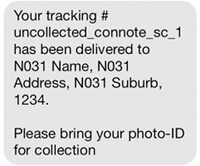

.. B2C Comms

.. toctree::
    :maxdepth: 2

Comms
=====

The Toll Parcel Portal comms facility manages comsumer notifications.
Notifications are provided via email and SMS.

The types of consumer notifications supported by the Comms facility are:

* **"Sorry we missed you ..."**

    Triggered when loaded into the Toll Parcel Portal database as per:

    * Service Code is NULL (unconditionally)

    * Service Code is not NULL and :ref:`comms_service_code_based_control`
      is enabled

* **Reminders**

    Triggered if the parcel has not been picked up a pre-defined period
    after the initial notification has been sent.  See :ref:`reminders` for
    more detail.

* **Primary Elect**

    Triggered *after* load into the Toll Parcel Portal database and
    verification has been obtained that the parcel has been delivered to
    the ADP.  Verification is typically provided via an alternate interface
    (for example, TCD report or TransSend).  See :ref:`primary_elect` for
    more detail

* **On Delivery to Alternate Delivery Point**

    Similar to *Primary Elect* in that the comms are triggerred *after*
    the load event into the Toll Parcel Portal database.  See
    :ref:`on_delivery_trigger` for more detail

* **Returns**

    As of *release v0.32*, consumers can return parcels to an Alternate
    Delivery Point.  Acceptance is receipted against email and SMS comms
    that are sent to the consumer in real time.  The Toll Parcel Portal
    website creates the returns comms event files

Comms Workflow
--------------

The various subsystems (:ref:`on_delivery_trigger`, :ref:`loader`,
:ref:`reminders`) generate a comms event by providing an
appropriately constructed file to the comms module interface.

.. note::

    The comms interface is a simple directory structure
    (default ``/data/nparcel/comms``)

Comms event files are processed by the ``npcommsd`` daemon process.

Enabling Returns Comms
^^^^^^^^^^^^^^^^^^^^^^

The Returns comms is unlike the other templates in that it builds its
information from a different database table (``returns``).  In code,
it follows a different login stream that must be enabled via the
following configration setting:

* :ref:`comms_uncontrolled_templates <comms_uncontrolled_templates>`

    The Returns facility is an exception to the comms send window
    in that a receipt should be received by the consumer at any time.
    As such, add the ``ret`` token to the ``comms.uncontrolled_templates``
    configuration setting.

    To suppress the ``ret`` template processing, remove the token from
    either ``comms.controlled_templates`` or
    ``comms.uncontrolled_templates``.  In this case, the ``npcommsd``
    daemon will simply ignore the ``ret`` -based comms event files.
    These files will continue to pool in the :ref:`comms_dir <comms_dir>`

    .. note::

        ``comms.controlled_templates`` has precedence over the list in
        ``comms.uncontrolled_templates``

Comms Event Files
-----------------

A comms event is defined by a simple, empty file which conforms to a defined
filename convention.  In general, a comms event file is formatted as
follows::

    <action>.<jobitem.id>.<template>

* **<action>**

    The communication medium (either ``email`` or ``sms``)

* **<jobitem.id>**

    The integer value representing the ``jobitem.id`` column in the
    Toll Parcel Portal database

* **<template>**

    Token that represents the template used to build the message

.. note..

    Comms event files are case sensitive

Template Structures
^^^^^^^^^^^^^^^^^^^

As of *release v0.32*, the template tokens that are currently supported are:

* **body**

* **delay**

* **pe**

* **ret**

Test Environment Identification and Disclaimer
^^^^^^^^^^^^^^^^^^^^^^^^^^^^^^^^^^^^^^^^^^^^^^

As of *version 0.34*, all comms that are generated from a non-production
instance of the Toll Parcel Portal middleware will have a special **TEST**
token added to the comms content.  In the case of e-mail, the **TEST**
token will be applied to the header *and* content.  E-mails will also feature a disclaimer:

.. note::

    Due to SMS character constraints, disclaimers will not be added to
    non-production SMS messages.  Instead, a simple ``TEST PLS IGNORE``
    string will be prepended to the message.

The comms facility identifies test messages by comparing the
:ref:`prod <prod>` configuration item with the hostname running the
Toll Parcel Portal middleware.

.. note::

    It is very important in production that the :ref:`prod <prod>`
    configuration is set correctly.  Otherwise, the system will
    flag all comms with the **TEST** token.

Identifying the name of your current server can be accomplished with
the ``hostname`` utility::

    $ hostname
    faswbaup02

In the example above, the string ``faswbaup02`` should be assigned to the
:ref:`prod <prod>` configuration item.

``npcommsd`` Configuration Items
--------------------------------

The ``npcommsd`` utility uses the default ``nparceld.conf`` configuration
file to control processing workflow.

.. note::

    all configuration settings are found under the ``[comms]`` section
    unless otherwise specified

.. _prod:

* ``prod`` (under the ``[environment]`` section)

    hostname of the production instance.  This is used to flag **TEST**
    comms messages

* ``failed_email`` (under the ``[rest]`` section))

    Email recipient for comms failures notification alerts

.. _comms_dir:

* ``comms`` (under the ``[dirs]`` section)

    Inbound interface where comms event files are read from.
    Default ``/data/nparcel/comms``

* ``comms_loop`` (under the ``[timeout]`` section)

    Control comms daemon facility sleep period between comms event file
    checks.  Default 30 seconds

* ``rest``

    The credentials and connection details required to interface to the
    Esendex SMS and email interfaces.  The config options include::

        sms_api = https://api.esendex.com/v1.0/messagedispatcher
        sms_user =
        sms_pw =
         
        email_api = https://apps.cinder.co/tollgroup/wsemail/emailservice.svc/sendemail
        email_user =
        email_pw =

* ``comms_q_warning``

    comms queue warning threshold.  If number of messages exceeds this
    threshold (and is under the :attr:`comms_q_error` threshold then a
    warning email notification is triggered.  Default 100.  A typical
    notification email is as follows:

.. image:: ../_static/comms_warning.png
    :align: center
    :alt: Toll Parcel Portal B2C Comms Queue Threshold Warning

* ``comms_q_error``

    comms queue error threshold.  If number of messages exceeds this
    threshold then an error email notification is triggered and
    the comms daemon is terminated.  Default 1000

* ``controlled_templates``

    list of comms templates that are controlled by the delivery
    period thresholds

.. _comms_uncontrolled_templates:

* ``uncontrolled_templates``

    list of comms templates that are *NOT* controlled by the delivery
    period thresholds.  In other words, comms can be sent 24 x 7.
    Default ``ret``

* ``skip_days``

    List of days to not send messages.  To avoid confusion,
    enter the full day name (Monday) separated by commas.  Default
    ``Sunday``

* ``send_time_ranges``

    Time ranges when comms *can* be sent.  Use 24 hour format and ensure
    that the times are day delimited.  Ranges must be separated with a
    hyphen '-' and use format HH:MM.  Multiple ranges are separated with
    commas.  Default ``default 08:00-19:00``)

``npcommsd`` usage
------------------

``npcommsd`` can be configured to run as a daemon as per the following::

    $ npcommsd -h
    usage: npcommsd [options] start|stop|status
    
    options:
      -h, --help            show this help message and exit
      -v, --verbose         raise logging verbosity
      -d, --dry             dry run - report only, do not execute
      -b, --batch           single pass batch mode
      -c CONFIG, --config=CONFIG
                            override default config
                            "/home/guest/.nparceld/nparceld.conf"
      -f FILE, --file=FILE  file to process inline (start only)

Errors
^^^^^^

There are a few places where things can go wrong:

1. Invalid email/SMS construct. For example, if number does not start with "04" then it is not a mobile
2. Network exception
3. Esendex response

1 and 2 should be covered in the code base.  For 3, Esendex return their
own response:

**SMS**::

    "<?xml version="1.0" encoding="utf-8"?><messageheaders batchid="fc8f4a85-a973-4d66-9f37-a1c73afabf7f" xmlns="http://api.esendex.com/ns/"><messageheader uri="https://api.esendex.com/v1.0/messageheaders/c321a89c-5ec7-4946-85f3-fb4ebaad07ab" id="c321a89c-5ec7-4946-85f3-fb4ebaad07ab" /></messageheaders>"

**Email**::

    "<string xmlns="http://schemas.microsoft.com/2003/10/Serialization/">[{"email":"lou.markovski@tollgroup.com","status":"sent","_id":"9ceb663a68e34ce0a178d928289c8bc0","reject_reason":null}]</string>

In both cases, these are string representations of some kind of structured
data.  For example, the SMS is XML based whereas the Email looks like a
bit of JSON.  For both email and SMS Esendex responses, the Comms module
simply logs the returned values.

.. note::

  The Esendex response is only the first-hop return value from their own
  interface.  We do not have any visibility of the interaction that
  Esendex have with the Telcos.  Therefore, there is still not a 100%
  guarantee that the message transfers were actually successful.  However,
  Esendex does provide another interface which we can query to verify the
  status of the message ID that they provide in their responses.  This is
  currently a manual process on a "need to know" basis.

When an error is detected in code, all efforts are made to alert the
Toll Parcel Point support email.  A sample failure email construct is as
follows:

    .. image:: ../_static/comms_failure.png
        :align: center
        :alt: Toll Parcel Point B2C Comms Failure Alert Email
