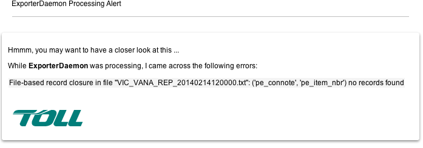

.. Toll Parcel Portal B2C Exporter

.. toctree::
    :maxdepth: 2

Exporter
========

The Toll Parcel Portal exporter facility is responsible for identifying
parcels that have been picked up by the consumer and closing off the
item/job/job_item within the Toll Parcel Portal database.

Closing Off a Toll Parcel Portal Parcel Record
----------------------------------------------

Closing off includes:

* Identify the record to close in the Toll Parcel Portal database

* Locate the Proof of Delivery (signature or PoD) files

* Generate the Exporter report

* Bundle the Exporter report with the PoD

* Stage the Exporter output into the relevant Business Unit's outbound
  FTP directory

Identify Records to Close Off
^^^^^^^^^^^^^^^^^^^^^^^^^^^^^

The trigger for a close-off event is a ``job_item`` record which has the
``pickup_ts`` column set (not ``NULL``) and ``extract_ts`` column not set
(``NULL``).  Here is an example of a close-off event
from the various upstream Business Units and extracts and loads parcel 
details into the Toll Parcel Portal in preparation for consumer pickup.

The list of Business Units supported include:

* Priority (``bu_id 1``)
* Fast (``bu_id 2``)
* IPEC (``bu_id 3``)

New in **version 0.30**, the ``npexporterd`` can close off ``job_item``
records via an existing report file.  This scenarios supports
Alternate Delivery Partners that maintain their own parcel collections
system.  For example, ParcelPoint.  In this case, it is important that
the parcel pickup is closed off in Toll Parcel Portal to manage the
consumer notifications.

.. note::

    Refer to the :ref:`exporter_in <exporter_in>` and
    :ref:`file_formats <file_formats>` configuration options
    to control the settings for report file-bases ``job_item`` close off.

In the odd event that a report based connote/item number lookup does not
exist in the Toll Parcel Portal database, then an email notification
similar to the following will be sent:

The email recipients list is defined by the
:ref:`support <support>` config item

Exporter Report Output
----------------------

Sample Exporter report::

    REF1|JOB_KEY|PICKUP_TIME|PICKUP_POD|IDENTITY_TYPE|IDENTITY_DATA|ITEM_NBR|AGENT_ID
    7179050166420|173357|2014-01-14 11:05:38|collected by home - simpson 2/2/2012|Manual POD|
    0000|00393403250082743890|Q081

The list of possible columns that can be displayed include:

* **REF1** - the job_item.connote_nbr value

* **JOB_KEY** - the job_item table primary key value.  In the case of an
  Alternate Delivery Partner such as ParcelPoint, this value is used to
  associate the POD signatures by filename

* **PICKUP_TIME** - the job_item.pickup_ts column value that represents
  the time at which the parcel was picked up.  Time is represented by the
  timezone relative to the supplying Alternate Delivery Point

* **PICKUP_POD** - short description of pickup scenario

* **IDENTITY_TYPE** - identification used to verify parcel recipient

* **ITEM_NBR** - the job_item.item_nbr value

* **AGENT_ID** - the agent.code value

* **AGENT_STATE** - the state in which the Alternate Delivery Partner
  resides in (agent.state)

.. note::

    Ordering and columns that are displayed can be controlled by the
    :ref:`exporter_fields <exporter_fields>` configuration item.

``npexporterd`` Configuration Items
^^^^^^^^^^^^^^^^^^^^^^^^^^^^^^^^^^^

``npexporterd`` uses the standard ``nparceld.conf`` configuration file to
control processing behaviour.  The following list details the required
configuration options:

* ``exporter_loop``

    time (seconds) between ``npexporterd`` processing iterations

.. _exporter_fields:

* ``exporter_fields`` (the ``[exporter_fields]`` section)

    Control the order in which the exporter displays column positions.
    The SQL produces rows in the following order::

        # 0: REF1
        # 1: JOB_KEY
        # 2: PICKUP_TIME
        # 3: PICKUP_POD
        # 4: IDENTITY_TYPE
        # 5: IDENTITY_DATA
        # 6: ITEM_NBR
        # 7: AGENT_ID
        # 8: AGENT_STATE

    The column ordering can be controlled by providing a comma separated
    list of indexes.  For example, to control **Priority** ordering::

        [exporter_fields]
        tolp = 0,1,2,3,5,6,4

    This will place the ``IDENTITY_TYPE`` column last.

.. note::
    The default is ordering is ``0,1,2,3,4,5,6``

* ``signature`` (under the ``[dirs]`` section)

    directory where POD signature files are kept

* ``staging_base`` (under the ``[dirs]`` section)

    Base directory to place processed collected reports and signature files
    for further processing.  The Business Unit directory structure is
    appended to the ``staging_base``.  For example in the case of
    **Priority**::

        <staging_base>/priority/in

* ``archive_dir`` (under the ``[dirs]`` section)

    Base directory where working files are archived to.  In the case of
    the exporter the processed signature file PODs are placed in::

        <archive_dir>/signature/<hash>

    .. note::

        refer to :ref:`pod_archiving` for more detail around the ``<hash>``
        algorithm

.. _exporter_in:

* ``exporter_in`` (under the ``[dirs]`` section)

    Defines a comma separated list of directories to search for file-based
    events to trigger a ``job_item`` closure::

        exporter_in = /data/nparcel/exporter_1,/data/nparcel/exporter_2

    These inbound directories typically align with the FTP inbound
    directory structure defined at :ref:`b2cftp`.

.. _file_formats:

* ``file_formats`` (under the ``[exporter]`` section)

    list of python-based regular expressions that represent the type of
    files that can be parsed by the exporter when polling the
    ``exporter_in`` directory.  For example ``.*_RE[PIF]_\d{14}\.txt$``
    will filter out the file ``VIC_VANA_REP_20140213120000.txt``

* ``state_reporting`` (set via the ``[conditions]`` map position 6)

    enable/disable state based reporting (see :ref:`state_based_reporting`)

* ``pe_pods`` (set via the ``[conditions]`` map position 7)

    enable/disable suppression of Primary Elect POD exports (see
    :ref:`suppress_pod`)

* ``connote_header`` (under the ``[exporter]`` section)

    token used to identify the connote column in the Exporter report
    file

* ``item_nbr_header`` (under the ``[exporter]`` section)

    token used to identify the item number column in the Exporter report
    file

.. _support:

* ``support`` (under the ``[email]`` section

    comma separated list of email addresses to receive notifications
    in case things go wrong

``npexporterd`` usage
^^^^^^^^^^^^^^^^^^^^^

``npexporterd`` can be configured to run as a daemon as per the following::

    $ npexporterd -h
    usage: npexporterd [options] start|stop|status
    
    options:
      -h, --help            show this help message and exit
      -v, --verbose         raise logging verbosity
      -d, --dry             dry run - report only, do not execute
      -b, --batch           single pass batch mode
      -c CONFIG, --config=CONFIG
                            override default config
                            "/home/npprod/.nparceld/nparceld.conf"
