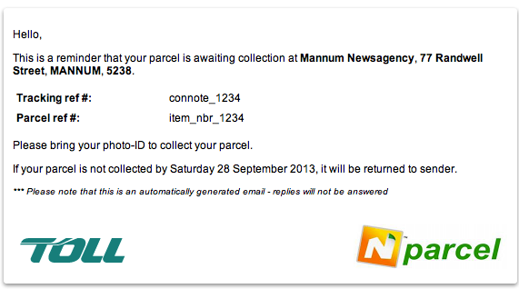
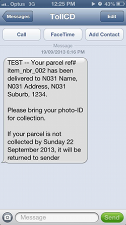
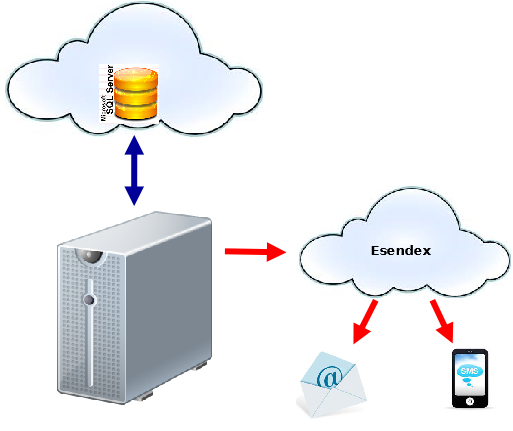

.. Nparcel B2C Reminder Notifications

.. toctree::
    :maxdepth: 2

Send Email/SMS Reminder Notifications
=====================================
Consumers are sent a reminder notification via Email and/or SMS if their
parcel has not been collected for a defined period (for example, 4 days).

*Uncollected Parcel Reminder notifications*

``npremind`` Configuration Items
--------------------------------
``npremind`` uses the generic ``nparceld.conf`` file to manage its
configuration.

``npremind`` specific
^^^^^^^^^^^^^^^^^^^^^
* ``[reminder]`` section

  * ``notification_delay`` is the period (in seconds) that triggers a
    reminder notice (default 345600 seconds -- 4 days)
  * ``start_date`` ignores records whose created_ts occurs before this date
    (default 2013-09-10 00:00:00)
  * ``hold_period`` defines the time period (in seconds) since the 
    job item was created and the agent will hold the parcel before being
    returned (default 691200 seconds -- 8 days)

``npremind`` shared
^^^^^^^^^^^^^^^^^^^
* ``[db]`` section to connect to the database
* ``[rest]`` section to interface to Esendex
* ``[proxy]`` section if proxy tunnelling is required (optional)

The ``npremind`` Interface
--------------------------
``npremind`` queries the Nparcel database to identify items which match
the following criteria:

.. note:: all configuration items are defined in ``nparceld.conf``

* ``job_item.created_ts`` column date occurs after the ``start_date``
  configuration item
* ``job_item.created_ts`` plus ``notification_delay`` period has elapsed
* parcel has not been picked up
* an email and/or mobile phone number exists
* a reminder has not already been sent

``npremind`` usage
------------------

::

    usage: npremind [options]
     
    options:
    -h, --help            show this help message and exit
    -v, --verbose         raise logging verbosity
    -d, --dry             dry run - show what would have been done
    -c CONFIG, --config=CONFIG
                            override default config
                            "/home/npprod/.nparceld/nparceld.conf"

``npremind`` has been designed to run as a batch process and can be
executed via cron with the following entry::

    0 8 * * * /users/npprod/npremind

.. note::
    the above crontab entry will send notifications every day at 8AM

