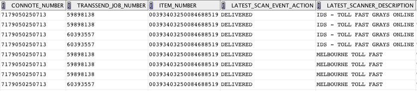

.. Toll Outlet Portal Middleware On Delivery Comms Trigger

.. toctree::
    :maxdepth: 2

.. _on_delivery_trigger:

On Delivery Comms Trigger
=========================

In addition to the "Sorry we missed you ..." scenario that redirects
parcels to an Alternate Delivery Point if the consumer is not present
at the nominated address to accept delivery, the Toll Outlet Portal
supports an On Delivery comms trigger.  In this case, a special
delivery type will suppress comms notifications during the initial
:mod:`top.loader` until which time that the parcel was physically
delivered to the Alternate Delivery Point.  The delivery types that
require this additional level of processing are:

* **Primary Elect** - where the consumer is able to nominate an
  Alternate Delivery Point from where they will pick up the parcel

* **Priority Transfer out to V123 (Service Code 4)** or **Driver Transfer
  out to ADP (Service Code 2)**

On Delivery comms trigger is processed by the ``topondeliveryd`` daemon.
The ``topondeliveryd`` daemon polls alternate interfaces to identify
a delivery event at the Alternate Delivery Point.

Parcels that are Pending Delivery
---------------------------------

Parcels that are pending delivery to an Alternate Delivery Point present
in the Toll Outlet Portal as:

* not being picked up (``jobitem.pickup_ts`` is ``NULL``)

* not having notifications set (``jobitem.notify_ts`` is ``NULL``)

* not aged (``jobitem.created_ts`` less than 14 days old)

* have a ``job.service_code`` 3 (Primary Elect) or 4 (Priority Transfer
  out to V123)

* are configured to generate On Delivery Comms as per
  :ref:`sc4_ondelivery_bu_ids` or :ref:`primary_elect_ondelivery`

Parcels (``job_items``) within Toll Outlet Portal that exhibit these traits
are extracted via the SQL query provided by
:meth:`top.table.jobitem.uncollected_jobitems_sql`.  From here,
``topondeliveryd`` will poll the alternate interfaces for a delivered event.

Delivery Partner Aware
^^^^^^^^^^^^^^^^^^^^^^

As of **version 0.36**, On Delivery can be further controlled at the
Alternate Delivery Point Delivery Partner level.

.. note::

    See the :ref:`comms_delivery_partners <comms_delivery_partners>`
    configuration option on how to add Delivery Partners per Business
    Unit.

For example, if Priority is configured to trigger comms for
Delivery Partner **Nparcel**, then all other parcels pending delivery
to another Delivery Partner (for example, **ParcelPoint**) will be
suppressed.  The configuration setting required for this behaviour is::

    [comms_delivery_partners]
    Priority = Nparcel

``topondeliveryd`` Interfaces
-----------------------------

The alternate interfaces used include:

* **TransSend** (polled by default)

* **TCD**

.. note::

    MTS was deprecated as part of **version 0.28**

All interfaces are polled by default.

.. _transsend:

TransSend
^^^^^^^^^

TransSend is an Oracle DB interface that can be used to identify
delivered parcels for **Priority** and **IPEC** (not **Fast**).  A typical
query set is shown below:

``topondeliveryd`` uses the ``CONNOTE_NUMBER`` / ``ITEM_NUMBER`` TransSend
columns to identify a parcel.  If found, it will check the
``LATEST_SCAN_EVENT_ACTION`` value for ``DELIVERED`` before setting the
comms events files.

.. note::

    as of **version 0.26**, comms are suppressed if the
    ``LATEST_SCANNER_DESCRIPTION`` contains
    ``IDS - TOLL FAST GRAYS ONLINE``.  This is required to suppress comms
    for **IPEC** to **Fast** overflow deliveries.

TCD
+++

New in **version 0.28**, ``topondeliveryd`` now takes a daily extraction
from TCD.  TCD push their report files to the Toll Outlet Portal FTP
interface.  Typical contents are as follows::

    MKL5050005831       20140211 00393403250088959404   20140212
    MKL5050005831       20140211 00393403250088959398   20140212

These line items are read as four space-separated columns where:

* column 1 -- ``Consignment Number``
* column 2 -- ``Despatch Date``
* column 3 -- ``Item Number``
* column 4 -- ``Delivery Date``

Should the ``Consignment Number`` / ``Item Number`` lookup result in a
valid ``Delivery Date`` value then ``topondeliveryd`` will generate a
comms events file.

Comms Templates
---------------

The delivery scenario (either **Primary Elect** or **Priority Transfer** out
to V123) will determine the type of comms template to use.  Primary Elect is
standard and simply uses the ``pe`` template.  For example, if
``job_item.id`` 12345 triggers an On Delivery event, then (if configured)
the comms events files generated include::

    $ ls -1 /data/top/comms
    $ email.12345.pe
    $ sms.12345.pe

Service Code 4 Template Selection
^^^^^^^^^^^^^^^^^^^^^^^^^^^^^^^^^

As of **version 0.36**, Service Code 4 On Delivery template selection
can be controlled via the :ref:`comms_sc4_template_control` configuration
condition map setting.  If the **delay** template is preferred over the
default **body** template then set position 12 of the ``conditions`` map for
the appropriate Business Unit.

``topondeliveryd`` Usage
------------------------

``topondeliveryd`` is a CLI-based daemoniser that controls the
On Delivery comms trigger process::

    $ topondeliveryd -h
    usage: topondeliveryd [options] start|stop|status
    
    options:
      -h, --help            show this help message and exit
      -v, --verbose         raise logging verbosity
      -d, --dry             dry run - report only, do not execute
      -b, --batch           single pass batch mode
      -c CONFIG, --config=CONFIG
                            override default config
                            "/home/npprod/.top/top.conf"
    -f FILE, --file=FILE  file to process inline (start only)

``topondeliveryd`` Configuration Items
--------------------------------------

The ``topondeliveryd`` utility uses the default ``top.conf`` file to
control processing workflows.

.. note::

    All configuration settings are found under the ``[primary_elect]``
    section unless otherwise specified

* ``tcd_in`` (under the ``[dirs]`` section)

    TCD Delivery Report inbound directory (default ``/data/top/tcd``)

* ``tcd_filename_format``

    TCD Delivery Report filename format as expressed as a Python
    regular expression string (default ``TCD_Delivery_\d{14}\.DAT``)

* ``file_cache_size``

    number of date-ordered TCD files to load during a
    processing loop.  Additonal files are deleted from the system

* ``comms`` (under the ``[dirs]`` section)

    directory where comms files are staged for further processing

* ``ondelivery_loop`` (under the ``[timeout]`` section)

    time (seconds) between ``topondeliveryd`` processing iterations

* ``pe_comms`` (set via the ``[conditions]`` map position 14)

    enable/disable Primary Elect notifications (On Delivery)

* ``sc4_comms_ids`` (set via the ``[conditions]`` map position 15)

    enable/disable Service Code 4 on delivery notification (On Delivery)

* ``db`` (the actual ``[db]`` section)

    Toll Outlet Portal database connectivity information.  A typical
    example is::

        [db]
        driver = FreeTDS
        host = SQVDBAUT07
        database = Nparcel
        user = npscript
        password = <passwd>

* ``transsend_db`` (the actual ``[transsend_db]`` section)

    TransSend database connectivity information.  A typical example is::

        [transsend_db]
        host = siedbdop01
        user = NPARCEL
        password = <password>
        port = 1521
        sid = TRCOPDOV

* ``uncollected_day_range``

    number in days to include in the ``jobitems.uncollected_jobitems_sql``
    query uncollected_day_range (default 14.0)

* ``delivered_header`` (under the ``[transsend]`` section)

    string that represents the TransSend column header name for a delivered
    item (default ``latest_scan_event_action``)

* ``delivered_event_key`` (under the ``[transsend]`` section)

    string that represents a delivered event (default ``delivered``)

* ``scan_desc_header`` (under the ``[transsend]`` section)

    the scanned description column header in TransSend
    (default ``latest_scanner_description``)

* ``scan_desc_keys`` (under the ``[transsend]`` section)

    list of scan_desc_header tokens to compare against
    (default ``IDS – TOLL FAST GRAYS ONLINE``)

.. _comms_delivery_partners:

* ``comms_delivery_partners`` (the actual ``[comms_delivery_partners]``
  section)

    a Business Unit based, comma separated list of Delivery Partners that
    will have comms event files created during the load process::

        [comms_delivery_partners]
        Priority = Nparcel
        Fast = Nparcel
        Ipec = Nparcel

    .. note::

        Delivery Partner names as per the ``delivery_partner.name`` column
        values which currently include Nparcel, ParcelPoint and Toll

    This section relies on the values in the ``[business_units]``
    section so make sure that if you add a Business Unit here that it is
    also covered in the ``[business_units]`` section.  Otherwise, the
    loader comms trigger will ignore it.
