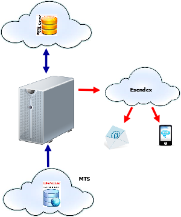

.. Toll Parcel Portal On Delivery Notifications

.. toctree::
    :maxdepth: 2

Primary Elect
=============
*New in version 0.14*

Primary Elect is a service provided to the customer that allows them
to nominate the Alternate Delivery Point from where they can pick up
their parcels.

Primary Elect jobs differ from the normal Toll Parcel Portal flow in that
the jobs are not triggerred by a failed delivery event.  Instead, jobs are
sent directly from the vendor (for example, Grays Online)

.. note::

    Current arrangement is a short-term solution to enable the Primary
    Elect service option whilst the various Business Units update their
    systems to accommodate such requests in the future.

The following diagram describes various interfaces:

*The Toll Parcel Portal B2C Primary Elect workflow*

Primary Elect jobs involve two additional interfaces to the normal
Toll Parcel Portal workflow:

* Raw WebMethods files from Toll GIS

* TCD Database

.. _primary_elect_workflow:

Primary Elect Workflow
----------------------

Raw WebMethods T1250 Files -- GIS
^^^^^^^^^^^^^^^^^^^^^^^^^^^^^^^^^
Since the various Business Units do not support Primary Elect jobs,
Toll Parcel Portal receives a direct feed from the GIS-prepared WebMethods
interface.  Toll Parcel Portal uses the :mod:`nparcel.mapper` middleware
component to translate the WebMethods format into typical T1250 EDI files.

The :mod:`mapper` workflow starts with the ``npmapperd`` script.
First, ``npmapperd`` will check for WebMethods raw T1250 and attempts to
translated these into T1250 EDI format.  From here, the translated
T1250 files are deposited into the corresponding Business Unit inbound
FTP resource directories where they enter into the normal Toll Parcel Portal
workflow.

.. note::

    Translated T1250 EDI files that are processed by ``nploaderd``
    **will not** generate comms files (Service Code ``3`` scenario)

Some notable functionality provided by the translation process:

* pre-populates the *Service Code* field (offset 842) with the value ``3``
  which represents a Primary Elect job type

``npmapperd`` Configuration Items
*********************************

:mod:`nparcel.mapper` uses the standard ``nparceld.conf`` configuration
file to define the WebMethods interface.  The following list details
the required configuration options:

* ``pe_in`` (default ``/var/ftp/pub/nparcel/gis/in``)

    found under the ``[dirs]`` section, inbound file from GIS are transfered
    via FTP into the ``pe_in`` directory.  ``pe_in`` represents the FTP
    resource that files are deposited to and where the ``mapper`` looks
    for files to process.

    .. note::

        As with the other FTP interfaces, the FTP resource needs to be
        created as per `these instructions <vsftpd.html>`_

* ``mapper_loop`` (default 30 (seconds))

    Control mapper daemon facility sleep period between inbound file checks.

* ``file_format`` (default ``T1250_TOL[PIF]_\d{14}\.dat``)

    File format represents the filename structure to parse for Primary Elect
    inbound.  This was prepared during development so it may change later
    on.  Better to adjust it via config then in code.

* ``file_archive_string`` (default ``T1250_TOL[PIF]_(\d{8})\d{6}\.dat``)
    Each T1250 should contain a YYYYMMDD sequence that defines date.  This
    is used by the archiver.  The file_archive_string captures the regular
    expression grouping that defines the date.

* ``customer`` (default ``gis``)
    Upstream provider of the T1250 files.

``npmapperd`` usage
*******************

``npmapper`` can be configured to run as a daemon as per the following::

    $ npmapperd -h
    usage: npmapperd [options] start|stop|status
    
    options:
      -h, --help            show this help message and exit
      -v, --verbose         raise logging verbosity
      -d, --dry             dry run - report only, do not execute
      -b, --batch           single pass batch mode
      -c CONFIG, --config=CONFIG
                              override default config
                              "/home/guest/.nparceld/nparceld.conf"
      -f FILE, --file=FILE  file to process inline (start only)

TCD Delivery Report Files
^^^^^^^^^^^^^^^^^^^^^^^^^

.. note::

    TCD is targeted at Fast deliveries since Fast events are not
    captured in TransSend.

In order to generate customer notification comms the :mod:`mapper` needs
to interogate the TCD Fast Delivery Report to capture job delivery times.

Primary Elect Nofitications
^^^^^^^^^^^^^^^^^^^^^^^^^^^
In a similar fashion to the ``npreminderd`` process, Primary Elect
consumer notifications are managed by a separate process,
:ref:`on_delivery_trigger`.  Here, the ``npondeliverd`` identifies all
Primary Elect jobs whose job items have not had their ``jobitem.notify_ts``
column set and cross references the connote/item number entries against
TransSend and TCD Fast Delivery Report.
