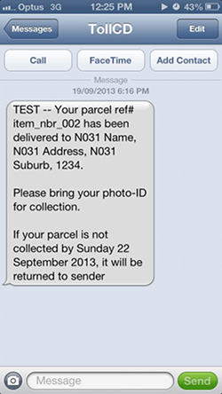
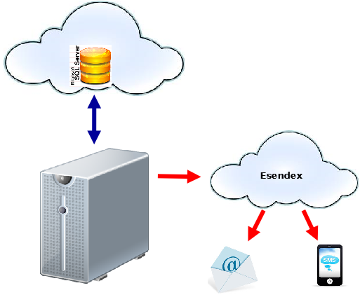

.. Toll Parcel Portal B2C Reminder Notifications

.. toctree::
    :maxdepth: 2

.. _reminders:

Email/SMS Reminder Notifications
================================

Consumers are sent a reminder notification via Email and/or SMS if their
parcel has not been collected for a defined period (for example, 4 days).

*Uncollected Parcel Reminder Email notifications*

*Uncollected Parcel Reminder SMS notifications*

Reminder Workflow
-----------------

``topreminderd`` queries the Toll Parcel Portal database to identify items
which match the following criteria:

* ``job_item.created_ts`` column date occurs after the ``start_date``
  configuration item

* ``job_item.notify_ts`` plus ``notification_delay`` period has elapsed

* parcel has not been picked up

* an email and/or mobile phone number exists

* a reminder has not already been sent

``topreminderd`` Configuration Items
^^^^^^^^^^^^^^^^^^^^^^^^^^^^^^^^^^^^
``topreminderd`` uses the generic ``top.conf`` file to manage its
configuration.

.. note::

    All configuration settings are found under the ``[primary_elect]``
    section unless otherwise specified

* ``notification_delay``

    Period (in seconds) that triggers a reminder notice (default 345600
    seconds -- 4 days)

* ``start_date``

    ignores records whose ``job_item.created_ts`` occurs before this date
    (default 2013-10-09 00:00:00)

* ``hold_period``

    defines the time period (in seconds) since notifications
    were first sent and the agent will hold the parcel before being
    returned (default 691200 seconds -- 8 days)

* ``comms`` (under the ``[dirs]`` section)

    directory where comms files are staged for further processing

* ``exporter_loop`` (under the ``[timeout]`` section)

    time (seconds) between ``topreminderd`` processing iterations

``topreminderd`` Usage
----------------------

``topreminderd`` can be configured to run as a daemon as per the following::

    usage: topreminderd [options]
     
    options:
    -h, --help            show this help message and exit
    -v, --verbose         raise logging verbosity
    -d, --dry             dry run - show what would have been done
    -c CONFIG, --config=CONFIG
                            override default config
                            "/home/npprod/.top/top.conf"
