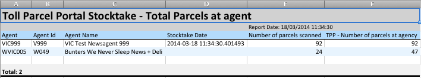

.. Toll Outlet Portal Middleware Stocktake Reporting

.. toctree::
    :maxdepth: 2

Stocktake Reporting
===================

The Stocktake reporting facility is a series of reports that capture
Business related scenarios and distributes this information to nominated
recipients.  The reports that are supported include:

* Uncollected
* Collected
* Complaince
* Non-compliance
* Totals
* Exception

Uncollected Reports
-------------------

Report on parcels that have been scanned by the Alternate Delivery Point
during their stocktake that present in the Toll Outlet Portal DB as aged
(``job_item.created_ts`` column value greater than 7 days)

The Uncollected report is run on a per business Unit basis defined by the
:attr:`b2ccconfig.reporterb2cconfig.bu_based` attribute setting under the
``[report_uncollected]`` section in ``top.conf``.

The following sample is for **Priority**:

Collected Reports
-----------------

Report against parcels that have been scanned by the Alternate Delivery Point
but marked as collected within the Toll Outlet Portal DB.

Compliance Reports
------------------

Report against Alternate Delivery Points that are in possession of an aged
parcel and have not performed a stocktake within the last 7 days.

If the **Last completed stocktake** header value is blank, this means
that the Alternate Delivery Point agent is in possesion of an aged
parcel but has not as yet performed a stocktake.

.. note::

    The Compliance report takes the longest time to complete and should
    be the last report in the :ref:`crontab <crontab>`

Non-compliance Reports
----------------------

The Non-compliance report captures two scenarios:

* Report against Alternate Delivery Points that have been flagged by the
  Toll Outlet Portal DB to be in possession of an uncollected parcel but
  have not scanned the parcel as part of their most recent stocktake.

* Report against parcels that have been scanned by and Alternate Delivery
  Point (**Scanning Agent** column) but appear at another ADP
  (**TPP Agent** column)

Totals
------

Report against number of parcels scanned by the Alternate Delivery Partner
compared to the number of parcels recorded in the Toll Outlet Portal DB
in the current stocktake.

Exception
---------

Report against parcels scanned by the Alternate Delivery Point during their
stocktake that do not exist in the Toll Outlet Portal DB.

``topreporter`` Configuration Items
-----------------------------------

The ``topreporter`` configuration items are contained within the default
``top.conf`` file and parsed by the
:mod:`top.b2cconfig.reporterb2cconfig` module.  The reporter
configuration items can be general or report-type specific.  The report
specific entities contain their own section headers in the format
``[report_<report_type>]``.

* ``db`` (the actual ``[db]`` section)

    Toll Outlet Portal database connectivity information.  A typical
    example is::

        [db]
        driver = FreeTDS
        host = SQVDBAUT07
        database = Nparcel
        user = npscript
        password = <passwd>

* ``report_bu_ids`` (the actual ``[report_bu_ids]`` section)

    Translation between DB Business IDs and human-readable variant to be
    displayed in the report.  For example::

        1 = Toll Priority
        2 = Toll Fast
        3 = Toll IPEC

    General across all reports

* ``report_outfile`` (under the ``[report_base]`` section)

    General report basename that is used to generate the report file.
    Default value ``Report_``.  Can be overriden by a report specific value

* ``report_outfile_ts_format`` (under the ``[report_base]`` section)

    Date/time format to append to the outfile.  Default ``%Y%m%d-%H:%M``

    General across all reports

* ``outdir`` (under the ``[report_base]`` section)

    Temporary working directory where report files are staged
    for further processing.

    General across all reports

* ``extension`` (under the ``[report_base]`` section)

    Report filename extension to append to the report file

    General across all reports

* ``display_headers`` (under the ``[report_<report_type>]`` section)

    List of ordered column headers to display in the report.  These values
    directory related to the SQL query's header output.  For example::

        display_hdrs = DP_CODE,AGENT_CODE,AGENT_NAME ...

    Specific value per report type

* ``outfile`` (under the ``[report_<report_type>]`` section)

    Report filename override

* ``recipients`` (under the ``[report_<report_type>]`` section)

    List of e-mail addresses to receive the report

* ``bu_based`` (under the ``[report_<report_type>]`` section)

    Flag to denote if the reports are to run on a per-Business basis

* ``delivery_partners`` (under the ``[report_<report_type>]`` section)

    list of Delivery Partner names to limit result set against.  For example::

        delivery_partners=Nparcel,Toll

    The values supported are as per the ``delivery_partner.name`` table set

* ``aliases`` (under the ``[report_<report_type>_aliases]`` section)

    Mapping between the raw display_hdrs and a preferred human readable
    format to present in the report.  For example::

        [report_uncollected_aliases]
        DP_CODE = Agent
        AGENT_CODE = Agent Id
        AGENT_NAME = Agent Name
        JOB_BU_ID = Business Unit
        ...

* ``widths`` (under the ``[report_<report_type>_widths]`` section)

    Mapping between header names and column widths.  For example::

        [report_uncollected_widths]
        Agent Name = 20
        Agent Address = 20
        Suburb = 20
        Phone Nbr = 15
        Connote = 25
        Item Nbr = 25
        To = 20
        Handover = 30

* ``ws`` (under the ``[report_<report_type>_ws]`` section)

    Worksheet specific attributes for Excel output.  The section options
    include:

    * ``title``

        the report title that will be emphasised and displayed
        on the first row.  For example::

            title = Toll Outlet Portal Stocktake Uncollected (Aged) Report

    * ``subtitle``

        the second level title that will be displayed on the second row.
        For example::

            subtitle = ITEMS UNCOLLECTED FOR MORE THAN 7 DAYS

    * ``sheet_title``

        the label to place on the first worksheet.  For example::

            sheet_title = Uncollected

``topreporter`` Usage
---------------------

Although the ``topreporter`` report wrapper is built on top of the
:mod:`utils.daemon` facility, it has been refactored to run in
batch mode.

::

    $ topreporter -h
    usage: topreporter [options] <uncollected|compliance|noncompliance|exception|totals|collected>
    
    options:
      -h, --help            show this help message and exit
      -v, --verbose         raise logging verbosity
      -d, --dry             dry run - report only, do not execute
      -b, --batch           single pass batch mode
      -c CONFIG, --config=CONFIG
                            override default config
                            "/home/npprod/.top/top.conf"

.. _crontab:

As such, periodic invocations should be configured to execute
via the system crontab.  The following except is a typical crontab
arrangement::

    # Stocktake Reports
    # Need to space out the timings because only one instance of the report
    # can run at any time.
    # Uncollected 
    0 7 * * 1-5 /usr/local/bin/topreporter uncollected
    # Non-Compliance
    1 7 * * 1-5 /usr/local/bin/topreporter noncompliance
    # Exception
    5 7 * * 1-5 /usr/local/bin/topreporter exception
    # Collected
    8 7 * * 1-5 /usr/local/bin/topreporter collected
    # Totals
    10 7 * * 1-5 /usr/local/bin/topreporter totals
    # Compliance (place last because it is the longest)
    15 7 * * 1-5 /usr/local/bin/topreporter compliance

.. note::

    As the :mod:`utils.daemon` facility only allows a single process
    excecution at any one time, the crontab entries should be staggered to
    avoid execution overlap
